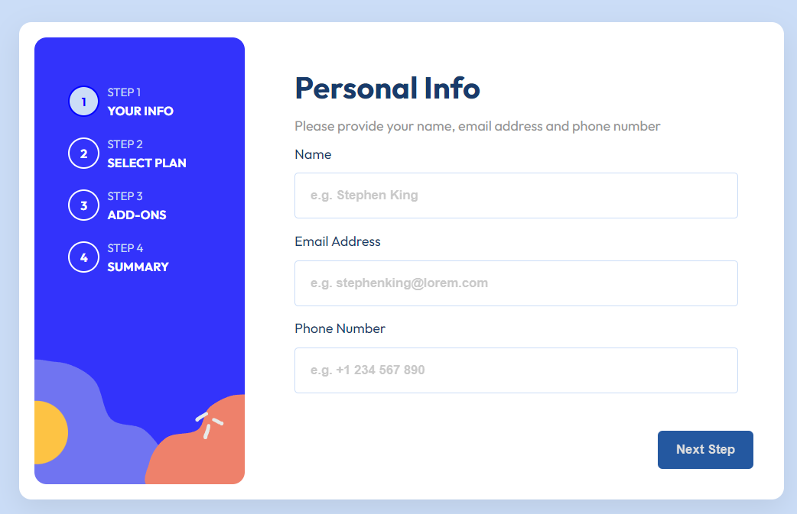
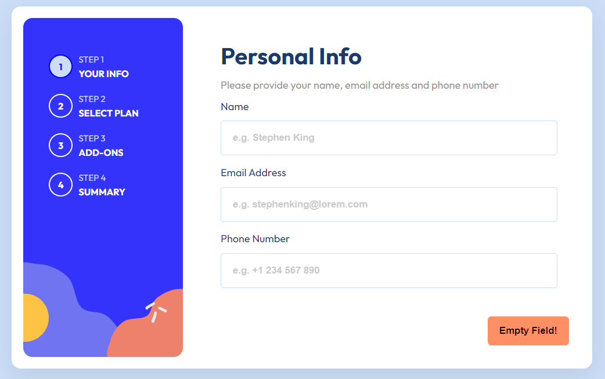
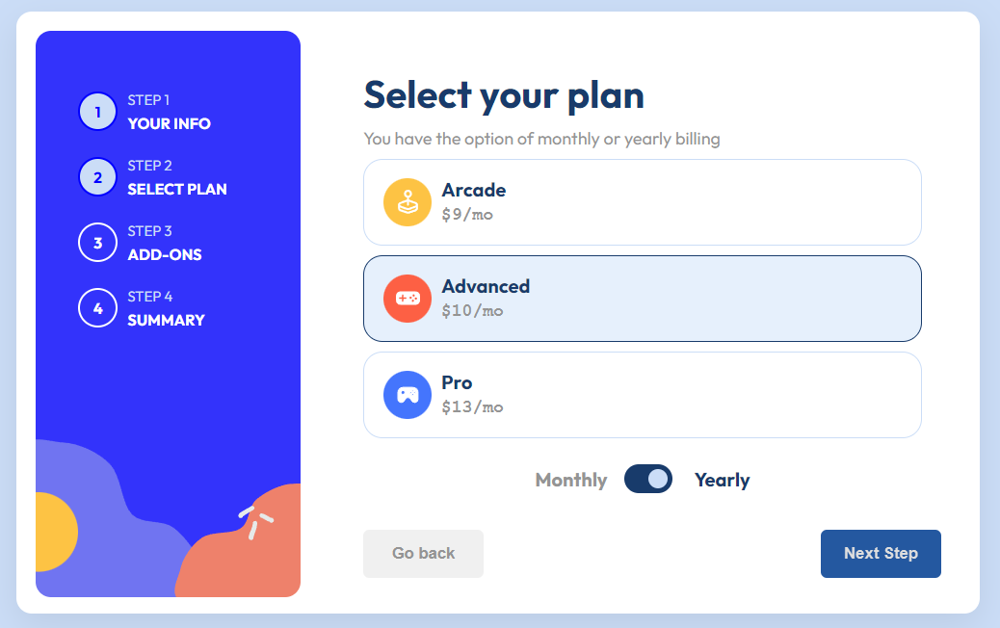
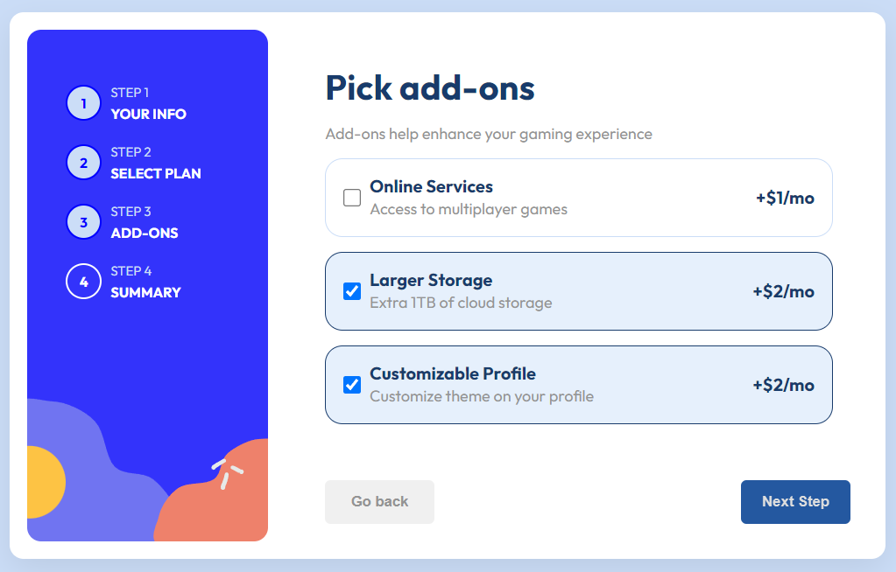
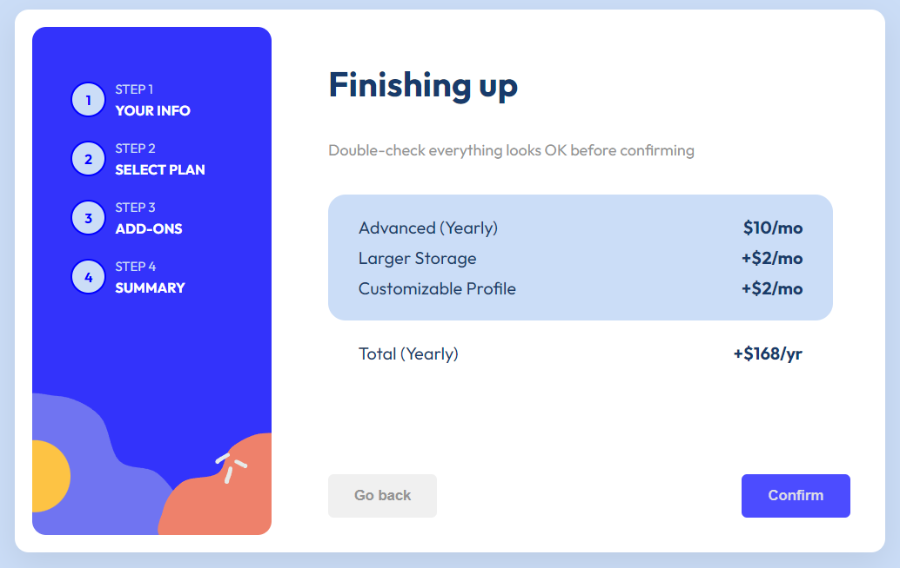
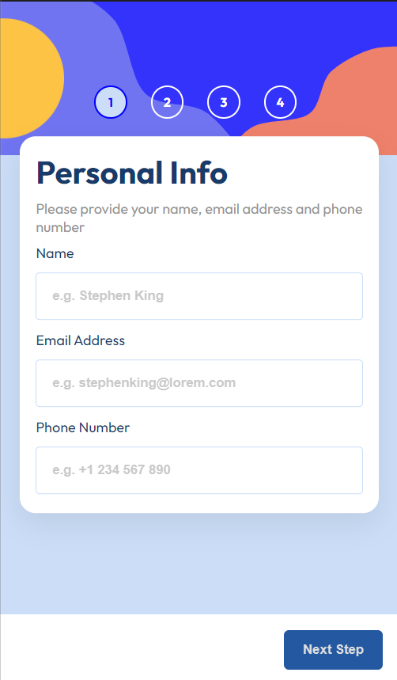
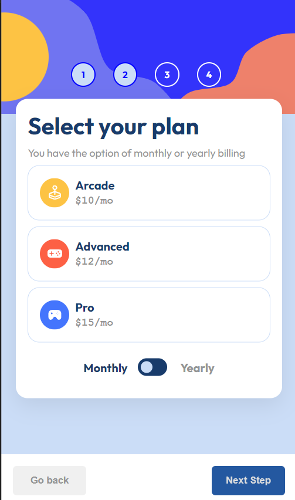
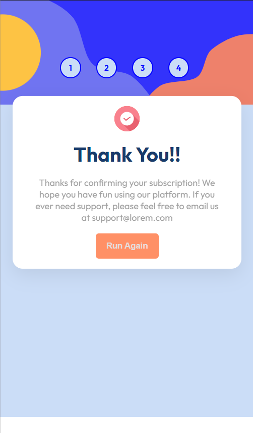

# Multi-Step-Form
 Its a multi step subscription form sample.

This is a multi step form sample built with html, css and javascript. The design for this is sourced from [frontend-mentor-challenges](https://www.frontendmentor.io/challenges).

Here are some of the previews for the page :-

---

## Home Screen

This is the first page of form with input fields and validation like a field can't be left empty and email should be in a valid format. The sidebar represents a progress counter showing the user which step they are on. 

---

## Second Page

This is the second page of the form. In here we have radio buttons and a toggle to change the subscription duration from monthly to yearly based of which price changes in this sample.

---

## Third Page

This is the third page of the form with checkboxes to the optional add-ons to your billing. Its there to add variety to the form of some fields being required and others are not.

---

## Fourth Page

This is the fourth page of the form displaying the summary of the form details filled in.
In a real world situation a payment gateway can be attached to it more over the form is also submitted here with the **Confirm** button.

---

## Thank You Page

This is the thank you page of the form showed after form submisson the **Run again** button here shows fresh form with empty fields.

---

## FrontEndMentor

This project is tagged as advanced in Frontend Mentor and it was really a tough one infact various things I did in this were not best practices at all. Its also my first time working with a form and should have researched a bit more but this one I decided to end today.

---

## Coding Map

1. I started with cloning the designs with html and css from the [frontend-mentor-challenges](https://www.frontendmentor.io/challenges) .

2. The challenge I faced the responsiveness of the form and to choose what breakpoints to consider. This was achieved by css variables.

3. After that I started working on the javascript code for the project . Whole app is supported by a single eventlistener which is very bad as it causes some conditional issues and caused bugs all over the place.

4. However I worked out of it made it work as intended **THE END**

## Deployment 

After completing the project I created a gitHub repo added my codebase and deployed the website using gitHub pages you access it from 
[Website Link](https://corack01.github.io/Multi-Step-Form/).

---

